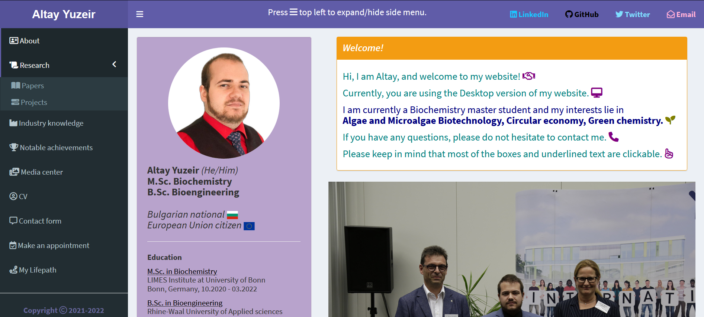

# Shiny_Personal_website

Personal webpage built with R/Shiny - https://altayyuzeir.shinyapps.io/home/

Mobile version which is optimized for small screens in portrait mode - https://altayyuzeir.shinyapps.io/home-m/

## Basic functionality
1. Hyperlinks to LinkedIn, GitHub, Twitter and Gmail
2. Basic information about education and experience
3. Theses and publications are shown in tables
4. Projects and industry knowledge with clicable boxes to download certificates and reports respectively
5. Media center to upload video and photos
6. Displayed CV with option to download
7. Leave-a-message section with comprehensive user input control
8. Multifunctional Appointments sections with comprehensive user input control
9. Interactive map of my life

## Advanced functionality
1. Custom colors for all boxes
2. Persistant data storage for sent messages and appointments
3. Automatic device detection (Mobile/Desktop) and redirecting to the appropreate page
4. Live notifications about messages or appointments send to phone in real time
